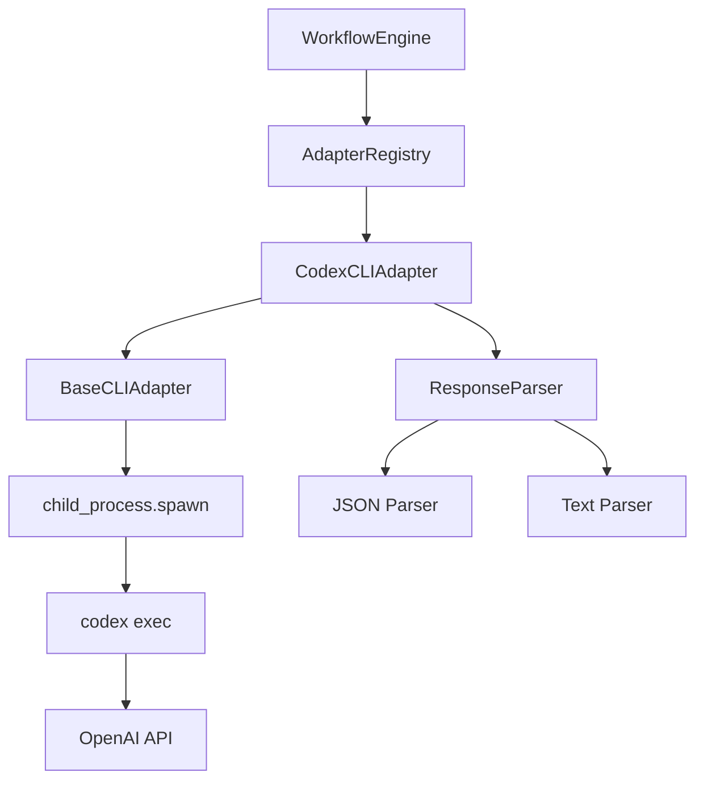

# Дизайн: Адаптер Codex CLI

## Обзор

Адаптер Codex CLI предоставляет интеграцию с утилитой командной строки Codex от OpenAI. Адаптер наследуется от `BaseCLIAdapter` и реализует специфичную логику для работы с командой `codex exec`, включая поддержку различных режимов выполнения, управление сессиями и парсинг вывода в JSON и текстовом форматах.

Основные возможности:
- Неинтерактивное выполнение запросов через `codex exec`
- Поддержка JSON и текстового режимов вывода
- Управление сессиями и возобновление диалогов
- Гибкая конфигурация через флаги командной строки
- Автоматический режим выполнения для CI/CD

## Архитектура

### Иерархия классов

```
CLIAdapter (interface)
    ↑
    |
BaseCLIAdapter (abstract class)
    ↑
    |
CodexCLIAdapter (concrete class)
```

### Взаимодействие компонентов



## Компоненты и интерфейсы

### CodexCLIAdapter

Основной класс адаптера, реализующий интеграцию с Codex CLI.

```typescript
export class CodexCLIAdapter extends BaseCLIAdapter {
  name: string = 'codex-cli';
  version: string = '1.0.0';
  
  constructor(config?: Partial<AdapterConfig>);
  protected prepareArguments(request: AdapterRequest): string[];
  parseResponse(rawOutput: string): string;
  async isAvailable(): Promise<boolean>;
}
```

#### Конфигурация по умолчанию

```typescript
{
  name: 'codex-cli',
  command: 'codex',
  args: ['exec'],  // Промпт добавляется динамически как последний аргумент
  env: {},
  parser: 'json',
  timeout: 300000  // 5 минут
}
```

### Подготовка аргументов

Метод `prepareArguments` формирует массив аргументов для команды `codex exec`:

1. Базовая команда: `['exec']`
2. Если указана модель: добавляется `['-m', model]`
3. Если требуется JSON-вывод: добавляется `['--json']`
4. Если указан режим full-auto: добавляется `['--full-auto']`
5. Если указана рабочая директория: добавляется `['--cd', directory]`
6. Если указан профиль: добавляется `['-p', profile]`
7. Промпт добавляется как последний аргумент

Пример результата:
```typescript
['exec', '-m', 'gpt-4', '--json', '--full-auto', 'Your prompt here']
```

### Парсинг ответа

Адаптер поддерживает два режима парсинга:

#### JSON-режим (--json)

Codex CLI возвращает newline-delimited JSON события:

```json
{"type":"status","message":"Starting..."}
{"type":"tool_use","tool":"bash","input":"ls -la"}
{"type":"message","role":"assistant","content":"Here are the files..."}
```

Парсер извлекает финальное сообщение ассистента:
1. Разбивает вывод по строкам
2. Парсит каждую строку как JSON
3. Фильтрует события типа `message` с ролью `assistant`
4. Возвращает контент последнего сообщения

#### Текстовый режим (по умолчанию)

Codex CLI возвращает форматированный текст с ANSI-кодами:

```
Starting task...
[Tool: bash] ls -la
total 48
drwxr-xr-x  12 user  staff   384 Jan 11 10:00 .
...


Assistant response:
Here are the files in your directory...
```

Парсер обрабатывает текстовый вывод:
1. Удаляет ANSI escape-коды
2. Ищет финальное сообщение ассистента
3. Удаляет служебные префиксы и метаданные
4. Возвращает чистый текст ответа

## Модели данных

### AdapterRequest (расширение)

```typescript
interface CodexAdapterRequest extends AdapterRequest {
  // Стандартные поля
  prompt: string;
  model?: string;
  
  // Специфичные для Codex CLI
  fullAuto?: boolean;        // Флаг --full-auto
  sandbox?: 'read-only' | 'workspace-write' | 'danger-full-access';
  workingDirectory?: string; // Флаг --cd
  profile?: string;          // Флаг -p
  enableSearch?: boolean;    // Флаг --search
  jsonOutput?: boolean;      // Флаг --json
  outputFile?: string;       // Флаг --output-last-message
  colorMode?: 'always' | 'never' | 'auto'; // Флаг --color
  configOverrides?: Record<string, string>; // Флаг -c
  
  // Для возобновления сессий
  resumeSession?: string;    // ID сессии для возобновления
  resumeLast?: boolean;      // Флаг --last
}
```

### JSONLEvent

Структура события в JSONL-выводе:

```typescript
interface JSONLEvent {
  type: 'status' | 'tool_use' | 'message' | 'error';
  message?: string;
  role?: 'user' | 'assistant';
  content?: string;
  tool?: string;
  input?: any;
  timestamp?: string;
}
```

## Свойства корректности

*Свойство - это характеристика или поведение, которое должно выполняться во всех корректных выполнениях системы - по сути, формальное утверждение о том, что система должна делать. Свойства служат мостом между человекочитаемыми спецификациями и машинопроверяемыми гарантиями корректности.*


### Свойство 1: Передача промпта в аргументах

*Для любого* запроса с промптом, подготовленные аргументы команды должны содержать промпт или флаг `-` для чтения из stdin.

**Проверяет: Требования 1.3, 1.4**

### Свойство 2: Добавление флага модели

*Для любого* запроса с указанной моделью, подготовленные аргументы должны содержать флаг `-m` или `--model` с именем модели.

**Проверяет: Требования 2.1**

### Свойство 3: Добавление флагов конфигурации

*Для любого* запроса с дополнительными опциями (sandbox, workingDirectory, profile, colorMode), подготовленные аргументы должны содержать соответствующие флаги с правильными значениями.

**Проверяет: Требования 3.2, 3.4, 8.3, 8.5**

### Свойство 4: Парсинг JSON-вывода

*Для любого* корректного JSONL-вывода, содержащего события типа `message` с ролью `assistant`, парсер должен извлечь контент последнего сообщения ассистента.

**Проверяет: Требования 4.2**

### Свойство 5: Парсинг текстового вывода

*Для любого* текстового вывода, содержащего ответ ассистента, парсер должен извлечь чистый текст ответа без служебной информации и ANSI-кодов.

**Проверяет: Требования 4.3, 4.5**

### Свойство 6: Возобновление сессии с ID

*Для любого* запроса с указанным ID сессии, подготовленные аргументы должны содержать команду `resume` и ID сессии.

**Проверяет: Требования 5.2**

### Свойство 7: Передача промпта при возобновлении

*Для любого* запроса на возобновление сессии с дополнительным промптом, промпт должен быть передан в аргументах команды.

**Проверяет: Требования 5.4**

### Свойство 8: Включение stderr в сообщение об ошибке

*Для любой* ошибки выполнения с непустым stderr, сообщение об ошибке должно содержать содержимое stderr.

**Проверяет: Требования 6.4**

### Свойство 9: Определение повторяемости ошибки

*Для любой* ошибки, метод `isRetryableError` должен корректно определять, можно ли повторить операцию, основываясь на типе ошибки (таймауты и сетевые ошибки - повторяемые, ошибки аутентификации - нет).

**Проверяет: Требования 6.5**

### Свойство 10: Добавление конфигурационных переопределений

*Для любого* набора конфигурационных переопределений, подготовленные аргументы должны содержать флаги `-c` с парами ключ=значение для каждого переопределения.

**Проверяет: Требования 8.4**

## Обработка ошибок

### Типы ошибок

1. **ADAPTER_NOT_FOUND**: Codex CLI не установлен или недоступен
2. **ADAPTER_AUTH_ERROR**: Ошибка аутентификации (отсутствует токен или неверные учетные данные)
3. **ADAPTER_TIMEOUT**: Команда превысила таймаут выполнения
4. **ADAPTER_INVALID_REQUEST**: Некорректный запрос (например, пустой промпт)
5. **ADAPTER_UNKNOWN_ERROR**: Неизвестная ошибка выполнения

### Стратегия обработки

```typescript
handleError(error: Error): AdapterError {
  const message = error.message.toLowerCase();
  
  // Определяем тип ошибки
  let code: string;
  let retryable: boolean;
  
  if (message.includes('not found') || message.includes('enoent')) {
    code = 'ADAPTER_NOT_FOUND';
    retryable = false;
  } else if (message.includes('authentication') || message.includes('unauthorized')) {
    code = 'ADAPTER_AUTH_ERROR';
    retryable = false;
  } else if (message.includes('timeout')) {
    code = 'ADAPTER_TIMEOUT';
    retryable = true;
  } else if (message.includes('invalid')) {
    code = 'ADAPTER_INVALID_REQUEST';
    retryable = false;
  } else {
    code = 'ADAPTER_UNKNOWN_ERROR';
    retryable = false;
  }
  
  return { code, message: error.message, retryable, originalError: error };
}
```

### Логирование ошибок

Все ошибки логируются с включением:
- Кода ошибки
- Сообщения об ошибке
- Содержимого stderr (если доступно)
- Времени выполнения до ошибки
- Флага retryable

## Стратегия тестирования

### Unit-тесты

Unit-тесты проверяют конкретные примеры и граничные случаи:

1. **Базовая функциональность**
   - Создание экземпляра адаптера с конфигурацией по умолчанию
   - Проверка имени и версии адаптера
   - Проверка базовой команды `codex exec`

2. **Подготовка аргументов**
   - Запрос без модели (использование модели по умолчанию)
   - Запрос с флагом `--full-auto`
   - Запрос с флагом `--last` для возобновления последней сессии
   - Запрос с флагом `--search`
   - Запрос с флагом `--output-last-message`

3. **Парсинг ответов**
   - Парсинг простого JSON-вывода с одним сообщением
   - Парсинг простого текстового вывода
   - Парсинг пустого вывода

4. **Обработка ошибок**
   - Ошибка "command not found" → ADAPTER_NOT_FOUND
   - Ошибка "authentication failed" → ADAPTER_AUTH_ERROR
   - Ошибка "timeout" → ADAPTER_TIMEOUT

5. **Проверка доступности**
   - Успешная проверка (команда `codex --version` возвращает 0)
   - Неуспешная проверка (команда не найдена)
   - Таймаут проверки (5 секунд)

### Property-based тесты

Property-based тесты проверяют универсальные свойства на множестве входных данных:

1. **Свойство 1: Передача промпта**
   - Генератор: случайные строки промптов
   - Проверка: промпт присутствует в аргументах или используется stdin

2. **Свойство 2: Флаг модели**
   - Генератор: случайные имена моделей
   - Проверка: флаг `-m` с моделью присутствует в аргументах

3. **Свойство 3: Флаги конфигурации**
   - Генератор: случайные комбинации опций (sandbox, workingDirectory, profile, colorMode)
   - Проверка: все указанные опции присутствуют в аргументах с правильными значениями

4. **Свойство 4: Парсинг JSON**
   - Генератор: случайные JSONL-выводы с событиями разных типов
   - Проверка: извлекается контент последнего сообщения ассистента

5. **Свойство 5: Парсинг текста**
   - Генератор: случайные текстовые выводы с ANSI-кодами и метаданными
   - Проверка: извлекается чистый текст без служебной информации

6. **Свойство 6: Возобновление сессии**
   - Генератор: случайные ID сессий (UUID)
   - Проверка: команда `resume` и ID присутствуют в аргументах

7. **Свойство 7: Промпт при возобновлении**
   - Генератор: случайные пары (ID сессии, промпт)
   - Проверка: и команда `resume`, и промпт присутствуют в аргументах

8. **Свойство 8: Stderr в ошибке**
   - Генератор: случайные ошибки с непустым stderr
   - Проверка: stderr включен в сообщение об ошибке

9. **Свойство 9: Повторяемость ошибок**
   - Генератор: случайные типы ошибок (таймауты, сетевые, аутентификация)
   - Проверка: корректное определение флага retryable

10. **Свойство 10: Конфигурационные переопределения**
    - Генератор: случайные наборы пар ключ=значение
    - Проверка: все пары присутствуют в аргументах с флагом `-c`

### Конфигурация тестов

- Минимум 100 итераций для каждого property-based теста
- Таймаут 30 секунд для каждого теста
- Использование библиотеки `fast-check` для TypeScript
- Теги для каждого теста: `Feature: codex-cli-adapter, Property N: <описание>`

### Интеграционные тесты

Интеграционные тесты проверяют взаимодействие с реальной утилитой Codex CLI (если доступна):

1. Выполнение простого запроса и получение ответа
2. Выполнение запроса с указанием модели
3. Выполнение запроса в режиме `--full-auto`
4. Парсинг реального JSON-вывода
5. Парсинг реального текстового вывода
6. Обработка реальных ошибок (например, неверный API ключ)

Интеграционные тесты помечаются как опциональные и выполняются только при наличии Codex CLI в системе.
