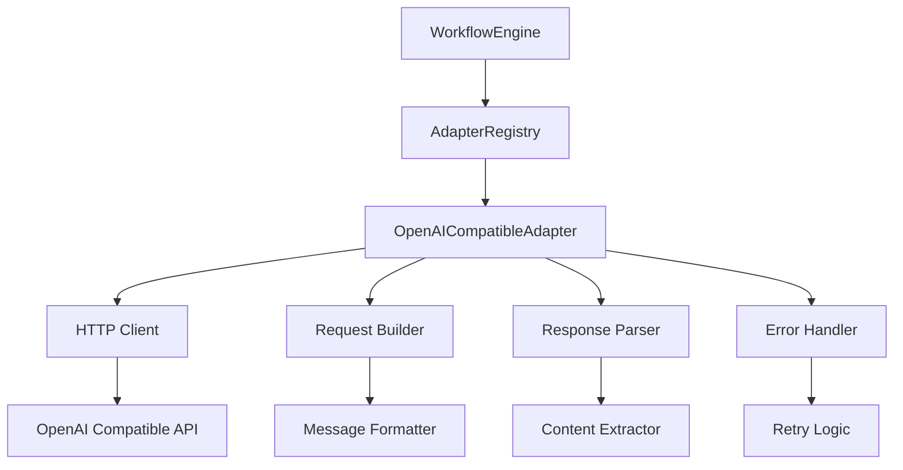

# Проектирование: OpenAI-совместимый HTTP API адаптер

## Обзор

OpenAI-совместимый адаптер предоставляет возможность взаимодействия с любыми сервисами, реализующими OpenAI API спецификацию. В отличие от существующего `OpenAICLIAdapter`, который использует утилиту командной строки `openai-cli`, этот адаптер работает напрямую с HTTP API через встроенный HTTP клиент Node.js.

Адаптер поддерживает:
- Локальные сервисы (LM Studio, LocalAI, Ollama, Text Generation WebUI)
- Облачные OpenAI-совместимые API
- Гибкую конфигурацию через YAML
- Полную совместимость с существующей архитектурой адаптеров

## Архитектура

### Иерархия классов

```
CLIAdapter (interface)
    ↑
    |
OpenAICompatibleAdapter
```

### Отличия от BaseCLIAdapter

`OpenAICompatibleAdapter` НЕ наследуется от `BaseCLIAdapter`, так как:
1. Не использует `child_process` для запуска внешних команд
2. Работает напрямую с HTTP API через `fetch` или `https` модуль
3. Имеет другую логику обработки запросов и ответов
4. Требует другой подход к таймаутам и retry логике

Вместо этого, адаптер напрямую реализует интерфейс `CLIAdapter`.

### Диаграмма компонентов



## Компоненты и интерфейсы

### 1. OpenAICompatibleAdapter

Основной класс адаптера, реализующий интерфейс `CLIAdapter`.

```typescript
export class OpenAICompatibleAdapter implements CLIAdapter {
  name: string = 'openai-compatible';
  version: string = '1.0.0';
  
  private baseUrl: string;
  private apiKey?: string;
  private defaultModel?: string;
  private timeout: number;
  private headers: Record<string, string>;
  
  constructor(config?: Partial<OpenAICompatibleConfig>)
  async isAvailable(): Promise<boolean>
  async execute(request: AdapterRequest): Promise<AdapterResponse>
  parseResponse(rawOutput: string): string
  handleError(error: Error): AdapterError
}
```

### 2. OpenAICompatibleConfig

Конфигурация адаптера.

```typescript
export interface OpenAICompatibleConfig {
  /** Имя адаптера */
  name: string;
  
  /** Базовый URL API (например, http://localhost:1234/v1) */
  baseUrl: string;
  
  /** API ключ для аутентификации (опционально) */
  apiKey?: string;
  
  /** Модель по умолчанию */
  defaultModel?: string;
  
  /** Таймаут запросов в миллисекундах */
  timeout?: number;
  
  /** Дополнительные HTTP заголовки */
  headers?: Record<string, string>;
}
```

### 3. HTTP Client

Внутренний компонент для выполнения HTTP запросов.

```typescript
interface HTTPClient {
  get(url: string, options: RequestOptions): Promise<HTTPResponse>
  post(url: string, body: unknown, options: RequestOptions): Promise<HTTPResponse>
}

interface RequestOptions {
  headers?: Record<string, string>
  timeout?: number
  signal?: AbortSignal
}

interface HTTPResponse {
  status: number
  statusText: string
  headers: Record<string, string>
  body: string
}
```

### 4. Request Builder

Компонент для формирования OpenAI-совместимых запросов.

```typescript
interface RequestBuilder {
  buildChatCompletionRequest(request: AdapterRequest): OpenAIChatRequest
}

interface OpenAIChatRequest {
  model: string
  messages: ChatMessage[]
  temperature?: number
  max_tokens?: number
}

interface ChatMessage {
  role: 'system' | 'user' | 'assistant'
  content: string
}
```

### 5. Response Parser

Компонент для парсинга ответов от API.

```typescript
interface ResponseParser {
  parseChatCompletion(response: string): ParsedResponse
}

interface ParsedResponse {
  content: string
  model: string
  tokensUsed?: {
    prompt: number
    completion: number
    total: number
  }
  finishReason?: string
}
```

## Модели данных

### OpenAI Chat Completion Request

```json
{
  "model": "gpt-3.5-turbo",
  "messages": [
    {
      "role": "system",
      "content": "You are a helpful assistant."
    },
    {
      "role": "user",
      "content": "Hello!"
    }
  ],
  "temperature": 0.7,
  "max_tokens": 1000
}
```

### OpenAI Chat Completion Response

```json
{
  "id": "chatcmpl-123",
  "object": "chat.completion",
  "created": 1677652288,
  "model": "gpt-3.5-turbo",
  "choices": [
    {
      "index": 0,
      "message": {
        "role": "assistant",
        "content": "Hello! How can I help you today?"
      },
      "finish_reason": "stop"
    }
  ],
  "usage": {
    "prompt_tokens": 10,
    "completion_tokens": 9,
    "total_tokens": 19
  }
}
```

### Error Response

```json
{
  "error": {
    "message": "Invalid API key",
    "type": "invalid_request_error",
    "code": "invalid_api_key"
  }
}
```

## Свойства корректности

*Свойство - это характеристика или поведение, которое должно выполняться во всех допустимых выполнениях системы - по сути, формальное утверждение о том, что должна делать система. Свойства служат мостом между человекочитаемыми спецификациями и машинопроверяемыми гарантиями корректности.*


### Свойство 1: Конфигурация корректно применяется

*Для любого* валидного набора параметров конфигурации (baseUrl, timeout, headers), создание адаптера должно сохранять эти параметры и использовать их при выполнении запросов.

**Validates: Requirements 1.1, 1.4, 1.5**

### Свойство 2: API ключ передается в заголовках

*Для любого* API ключа, если он указан в конфигурации, он должен присутствовать в заголовке Authorization всех HTTP запросов в формате "Bearer {apiKey}".

**Validates: Requirements 1.2**

### Свойство 3: Запрос корректно формируется

*Для любого* AdapterRequest с промптом, моделью, системным промптом и параметрами генерации, сформированный HTTP запрос должен:
- Быть POST запросом к эндпоинту /chat/completions
- Содержать промпт как сообщение с ролью "user"
- Содержать системный промпт (если указан) как первое сообщение с ролью "system"
- Содержать имя модели в параметре "model"
- Содержать параметры temperature и max_tokens (если указаны)

**Validates: Requirements 2.1, 2.2, 2.3, 2.4, 2.5**

### Свойство 4: Ответ корректно парсится

*Для любого* валидного OpenAI API ответа, парсинг должен:
- Извлекать текст из choices[0].message.content (всегда первый вариант)
- Сохранять информацию о модели из поля "model"
- Сохранять информацию об использовании токенов из поля "usage" в metadata
- Измерять и возвращать время выполнения запроса

**Validates: Requirements 3.1, 3.2, 3.3, 3.4**

### Свойство 5: HTTP статусы маппятся на коды ошибок

*Для любого* HTTP ответа с ошибкой, код ошибки должен определяться следующим образом:
- Сетевые ошибки (ECONNREFUSED, ETIMEDOUT и т.д.) → ADAPTER_NETWORK_ERROR
- Статус 401 или 403 → ADAPTER_AUTH_ERROR
- Статус 404 → ADAPTER_NOT_FOUND
- Статус 429 → ADAPTER_RATE_LIMIT
- Таймаут → ADAPTER_TIMEOUT
- Статус 500 или 503 → ADAPTER_SERVER_ERROR

**Validates: Requirements 5.1, 5.2, 5.3, 5.4, 5.5, 5.6**

### Свойство 6: Retryable флаг устанавливается правильно

*Для любой* ошибки адаптера, флаг retryable должен быть:
- true для кодов: ADAPTER_NETWORK_ERROR, ADAPTER_RATE_LIMIT, ADAPTER_TIMEOUT, ADAPTER_SERVER_ERROR
- false для кодов: ADAPTER_AUTH_ERROR, ADAPTER_NOT_FOUND, ADAPTER_INVALID_REQUEST

**Validates: Requirements 5.4, 5.5, 5.6**

### Свойство 7: Сообщения об ошибках извлекаются из ответа

*Для любого* ответа API с объектом error, сообщение об ошибке должно извлекаться из error.message и включаться в AdapterError.

**Validates: Requirements 5.7**

### Свойство 8: Проверка доступности работает корректно

*Для любого* базового URL:
- Если GET запрос к /models возвращает статус 200, isAvailable() должен возвращать true
- Если GET запрос к /models возвращает ошибку или не-200 статус, isAvailable() должен возвращать false
- Проверка должна использовать короткий таймаут (5 секунд)

**Validates: Requirements 4.2, 4.3, 4.4**

### Свойство 9: Адаптер устойчив к неподдерживаемым параметрам

*Для любого* запроса с параметрами, которые могут не поддерживаться сервисом, адаптер должен отправлять их в теле запроса, но не падать если сервис их игнорирует или возвращает ошибку валидации для них.

**Validates: Requirements 6.6**

### Свойство 10: Все параметры AdapterRequest обрабатываются

*Для любого* валидного AdapterRequest, адаптер должен корректно обрабатывать все стандартные поля: prompt, model, temperature, maxTokens, systemPrompt, timeout.

**Validates: Requirements 7.5**

### Свойство 11: Переменные окружения подставляются

*Для любой* строки конфигурации в формате "${VAR_NAME}", значение должно подставляться из переменных окружения process.env.VAR_NAME.

**Validates: Requirements 8.6**

## Обработка ошибок

### Категории ошибок

1. **Сетевые ошибки** (ADAPTER_NETWORK_ERROR)
   - Невозможно подключиться к серверу
   - Таймаут соединения
   - DNS ошибки
   - Retryable: true

2. **Ошибки аутентификации** (ADAPTER_AUTH_ERROR)
   - Неверный API ключ
   - Отсутствие прав доступа
   - Retryable: false

3. **Ошибки не найдено** (ADAPTER_NOT_FOUND)
   - Эндпоинт не существует
   - Модель не найдена
   - Retryable: false

4. **Ошибки лимитов** (ADAPTER_RATE_LIMIT)
   - Превышен rate limit
   - Квота исчерпана
   - Retryable: true

5. **Ошибки таймаута** (ADAPTER_TIMEOUT)
   - Запрос превысил таймаут
   - Retryable: true

6. **Серверные ошибки** (ADAPTER_SERVER_ERROR)
   - Внутренняя ошибка сервера (500)
   - Сервис недоступен (503)
   - Retryable: true

7. **Ошибки валидации** (ADAPTER_INVALID_REQUEST)
   - Неверный формат запроса
   - Отсутствуют обязательные параметры
   - Retryable: false

### Стратегия обработки

```typescript
// Псевдокод обработки ошибок
try {
  const response = await httpClient.post(url, body, options);
  return parseResponse(response);
} catch (error) {
  if (isNetworkError(error)) {
    return createError('ADAPTER_NETWORK_ERROR', error, true);
  }
  if (isTimeoutError(error)) {
    return createError('ADAPTER_TIMEOUT', error, true);
  }
  if (error.status === 401 || error.status === 403) {
    return createError('ADAPTER_AUTH_ERROR', error, false);
  }
  if (error.status === 404) {
    return createError('ADAPTER_NOT_FOUND', error, false);
  }
  if (error.status === 429) {
    return createError('ADAPTER_RATE_LIMIT', error, true);
  }
  if (error.status >= 500) {
    return createError('ADAPTER_SERVER_ERROR', error, true);
  }
  return createError('ADAPTER_UNKNOWN_ERROR', error, false);
}
```

### Извлечение сообщений об ошибках

Адаптер пытается извлечь сообщение об ошибке из тела ответа в следующем порядке:
1. `error.message` (стандартный формат OpenAI)
2. `error.error.message` (альтернативный формат)
3. `message` (упрощенный формат)
4. Полное тело ответа (если не JSON)
5. HTTP статус текст (если тело пустое)

## Стратегия тестирования

### Двойной подход к тестированию

Используем комбинацию unit-тестов и property-based тестов для всесторонней проверки:

**Unit-тесты:**
- Конкретные примеры использования
- Граничные случаи
- Интеграция с AdapterRegistry
- Примеры конфигураций для разных сервисов (LM Studio, LocalAI)

**Property-based тесты:**
- Универсальные свойства для всех входных данных
- Генерация случайных запросов и конфигураций
- Проверка инвариантов (например, время выполнения всегда > 0)
- Проверка корректности парсинга для всех валидных ответов

### Конфигурация property-based тестов

- Библиотека: `fast-check` (для TypeScript/JavaScript)
- Минимум 100 итераций на тест
- Каждый тест помечен комментарием с номером свойства из design.md

Пример тега:
```typescript
// Feature: openai-compatible-adapter, Property 3: Запрос корректно формируется
```

### Моки и тестовые данные

Для unit-тестов используем:
- Мок HTTP клиента для изоляции от сети
- Фикстуры с примерами ответов от разных сервисов
- Мок сервер для интеграционных тестов (опционально)

Для property-based тестов используем:
- Генераторы случайных AdapterRequest
- Генераторы случайных OpenAI API ответов
- Генераторы случайных ошибок HTTP

### Тестовые сценарии

**Unit-тесты:**
1. Создание адаптера с конфигурацией по умолчанию
2. Создание адаптера с кастомной конфигурацией
3. Регистрация в AdapterRegistry
4. Проверка доступности (успех и неудача)
5. Выполнение простого запроса
6. Выполнение запроса с системным промптом
7. Обработка различных HTTP ошибок
8. Парсинг ответа с токенами
9. Парсинг ответа без токенов
10. Извлечение сообщений об ошибках

**Property-based тесты:**
1. Свойство 1: Конфигурация корректно применяется
2. Свойство 2: API ключ передается в заголовках
3. Свойство 3: Запрос корректно формируется
4. Свойство 4: Ответ корректно парсится
5. Свойство 5: HTTP статусы маппятся на коды ошибок
6. Свойство 6: Retryable флаг устанавливается правильно
7. Свойство 7: Сообщения об ошибках извлекаются
8. Свойство 8: Проверка доступности работает корректно
9. Свойство 9: Адаптер устойчив к неподдерживаемым параметрам
10. Свойство 10: Все параметры AdapterRequest обрабатываются
11. Свойство 11: Переменные окружения подставляются

## Примеры использования

### Конфигурация для LM Studio

```yaml
adapters:
  - name: lm-studio
    type: openai-compatible
    baseUrl: http://localhost:1234/v1
    defaultModel: local-model
    timeout: 60000
```

### Конфигурация для LocalAI

```yaml
adapters:
  - name: localai
    type: openai-compatible
    baseUrl: http://localhost:8080/v1
    apiKey: ${LOCALAI_API_KEY}
    defaultModel: gpt-3.5-turbo
```

### Конфигурация для Ollama (OpenAI режим)

```yaml
adapters:
  - name: ollama
    type: openai-compatible
    baseUrl: http://localhost:11434/v1
    defaultModel: llama2
```

### Конфигурация для официального OpenAI API

```yaml
adapters:
  - name: openai
    type: openai-compatible
    baseUrl: https://api.openai.com/v1
    apiKey: ${OPENAI_API_KEY}
    defaultModel: gpt-4
    timeout: 120000
```

### Использование в коде

```typescript
import { OpenAICompatibleAdapter } from './adapters/openai-compatible-adapter';
import { AdapterRegistry } from './adapters/adapter-registry';

// Создание адаптера для LM Studio
const lmStudio = new OpenAICompatibleAdapter({
  name: 'lm-studio',
  baseUrl: 'http://localhost:1234/v1',
  defaultModel: 'local-model'
});

// Регистрация в реестре
const registry = new AdapterRegistry();
registry.register(lmStudio);

// Выполнение запроса
const response = await lmStudio.execute({
  prompt: 'Привет! Как дела?',
  temperature: 0.7,
  maxTokens: 100
});

console.log(response.content);
```

## Зависимости

### Внешние зависимости

- **Node.js встроенные модули:**
  - `https` - для HTTP запросов
  - `http` - для HTTP запросов (опционально)
  
- **Опциональные зависимости:**
  - `node-fetch` - если нужна поддержка старых версий Node.js (< 18)
  - `abort-controller` - для поддержки таймаутов в старых версиях

### Внутренние зависимости

- `src/core/types.ts` - интерфейсы CLIAdapter, AdapterRequest, AdapterResponse, AdapterError
- `src/adapters/adapter-registry.ts` - регистрация адаптера

## Ограничения и будущие улучшения

### Текущие ограничения

1. **Нет поддержки функций (function calling)** - будет добавлено при необходимости
2. **Нет кэширования ответов** - может быть добавлено для оптимизации
3. **Нет автоматического retry** - retry логика на уровне WorkflowEngine
4. **Нет поддержки streaming** - оркестратор работает с полными ответами

### Будущие улучшения

1. **Streaming поддержка**
   - Если оркестратор будет поддерживать инкрементальные результаты
   - Обработка Server-Sent Events (SSE)
   - Callback для получения частичных результатов

2. **Function calling**
   - Поддержка tools параметра
   - Обработка function_call ответов
   - Автоматическое выполнение функций

3. **Расширенная конфигурация**
   - Поддержка прокси
   - Кастомные SSL сертификаты
   - Retry политики на уровне адаптера

4. **Оптимизации**
   - Connection pooling
   - Кэширование ответов
   - Батчинг запросов

5. **Мониторинг**
   - Метрики производительности
   - Логирование запросов/ответов
   - Трейсинг для отладки
