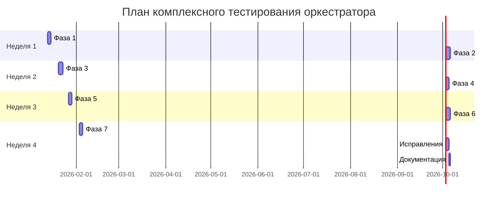

# Дорожная карта тестирования Workflow Orchestrator

## 🗓️ Временная шкала



## 🎯 Фазы выполнения

### 📦 Фаза 1: Инфраструктура (2 дня)
```
День 1: Структура и базовые утилиты
├── Создать директории тестов
├── Реализовать TestAdapter
└── Создать AdapterTestHelper

День 2: Продвинутые утилиты
├── Создать WorkflowTestHelper
├── Создать ArtifactTestHelper
└── Checkpoint: Проверка инфраструктуры
```

**Результат:** Готовая инфраструктура для всех тестов

---

### 🔌 Фаза 2: CLI-адаптеры (3 дня)
```
День 1: Обертки адаптеров
├── ClaudeCliAdapter
├── OpenAiCliAdapter
└── GeminiCliAdapter

День 2: Тесты claude-cli
├── Простой workflow
├── Сложный workflow
├── Обработка ошибок
└── Таймауты

День 3: Тесты openai-cli и gemini-cli
├── Тесты openai-cli (3 теста)
├── Тесты gemini-cli (3 теста)
├── Тест недоступного адаптера
└── Checkpoint: Интеграция
```

**Результат:** Подтверждение работы с реальными AI

---

### ⚠️ Фаза 3: Обработка ошибок (3 дня)
```
День 1: Script и Adapter ошибки
├── Синтаксические ошибки
├── Runtime ошибки
├── Exit codes
├── Недоступные адаптеры
└── Таймауты

День 2: Template и Filesystem ошибки
├── Несуществующие переменные
├── Циклические зависимости
├── Проблемы с правами
└── Нет места на диске

День 3: Validation ошибки
├── Невалидная конфигурация
├── Несуществующие зависимости
├── Циклические зависимости шагов
└── Checkpoint: Обработка ошибок
```

**Результат:** Устойчивая система с понятными ошибками

---

### 🔄 Фаза 4: Resume (2 дня)
```
День 1: Сохранение и восстановление
├── Сохранение при прерывании
├── Сохранение при ошибке
├── Resume после прерывания
└── Resume после ошибки

День 2: Валидация и изменения
├── Отсутствующие артефакты
├── Поврежденные артефакты
├── Изменение конфигурации
└── Checkpoint: Resume
```

**Результат:** Надежное возобновление процессов

---

### 👤 Фаза 5: Пользовательский ввод (2 дня)
```
День 1: Типы ввода
├── Текстовый ввод (короткий, длинный, многострочный)
├── Выбор из списка (одиночный, множественный)
└── Числовой ввод

День 2: Валидация и отмена
├── Обязательные поля
├── Форматы (email, etc)
├── Диапазоны
├── Отмена (Ctrl+C, ESC)
└── Checkpoint: Пользовательский ввод
```

**Результат:** Удобный интерактивный интерфейс

---

### ⚡ Фаза 6: Производительность (3 дня)
```
День 1: Большие workflow
├── Генератор workflow
├── 50 шагов
├── 100 шагов
└── 200 шагов

День 2: Большие артефакты и параллелизм
├── 1MB артефакты
├── 10MB артефакты
├── 100MB артефакты
├── 5 параллельных шагов
├── 10 параллельных шагов
└── 20 параллельных шагов

День 3: Кэширование и оптимизация
├── Эффективность кэша
├── Очистка кэша
├── TTL кэша
├── Производительность шаблонов
├── Профилирование
└── Checkpoint: Производительность
```

**Результат:** Масштабируемая система

---

### 📝 Фаза 7: Дополнительно (2 дня)
```
День 1: Логирование
├── Время выполнения
├── Stack traces
├── Debug режим
└── Итоговые отчеты

День 2: Обратная совместимость
├── Старые конфигурации
├── Устаревший синтаксис
├── Новые поля
└── Финальный checkpoint
```

**Результат:** Полностью протестированная система

---

### 🔧 Исправления (2 дня)
```
День 1-2: Исправление найденных проблем
├── Анализ результатов тестов
├── Исправление критических багов
├── Исправление некритических багов
└── Повторное тестирование
```

---

### 📚 Документация (1 день)
```
День 1: Финализация документации
├── Обновить DEBUGGING_REPORT.md
├── Обновить TESTING_STATUS.md
├── Создать RELEASE_NOTES.md
└── Обновить README.md
```

---

## 📊 Распределение усилий

```
Фаза 1: Инфраструктура        ████░░░░░░░░░░░░░░░░  10%
Фаза 2: CLI-адаптеры          ██████░░░░░░░░░░░░░░  15%
Фаза 3: Обработка ошибок      ████████░░░░░░░░░░░░  20%
Фаза 4: Resume                ████░░░░░░░░░░░░░░░░  10%
Фаза 5: Пользовательский ввод ████░░░░░░░░░░░░░░░░  10%
Фаза 6: Производительность    ██████████░░░░░░░░░░  25%
Фаза 7: Дополнительно         ██░░░░░░░░░░░░░░░░░░   5%
Исправления                   ██░░░░░░░░░░░░░░░░░░   5%
```

## 🎯 Ключевые вехи (Milestones)

### Milestone 1: Инфраструктура готова ✅
**Дата:** День 2  
**Критерии:**
- ✅ Все утилиты реализованы
- ✅ Базовые тесты утилит проходят
- ✅ Структура директорий создана

### Milestone 2: Интеграция с адаптерами ✅
**Дата:** День 5  
**Критерии:**
- ✅ Минимум 2 реальных адаптера работают
- ✅ Все тесты интеграции проходят
- ✅ Обработка ошибок адаптеров работает

### Milestone 3: Устойчивость к ошибкам ✅
**Дата:** День 8  
**Критерии:**
- ✅ Все типы ошибок обрабатываются
- ✅ Сообщения об ошибках понятны
- ✅ Система не падает при ошибках

### Milestone 4: Resume работает ✅
**Дата:** День 10  
**Критерии:**
- ✅ Resume работает в 100% сценариев
- ✅ Состояние корректно восстанавливается
- ✅ Артефакты валидируются

### Milestone 5: Готово к production ✅
**Дата:** День 15  
**Критерии:**
- ✅ Все тесты проходят
- ✅ Покрытие > 90%
- ✅ Производительность соответствует требованиям
- ✅ Документация обновлена

## 🚦 Критические пути

### Критический путь 1: Инфраструктура → CLI-адаптеры
```
Фаза 1 (обязательна) → Фаза 2
```
Без инфраструктуры невозможно тестировать адаптеры

### Критический путь 2: CLI-адаптеры → Обработка ошибок
```
Фаза 2 (обязательна) → Фаза 3
```
Нужны работающие адаптеры для тестирования ошибок

### Критический путь 3: Обработка ошибок → Resume
```
Фаза 3 (обязательна) → Фаза 4
```
Resume зависит от корректной обработки ошибок

## ⚠️ Риски и митигация

### Риск 1: Недоступность реальных адаптеров
**Вероятность:** Средняя  
**Влияние:** Высокое  
**Митигация:**
- Использовать mock-адаптеры для большинства тестов
- Тестировать с реальными адаптерами опционально
- Документировать требования к адаптерам

### Риск 2: Проблемы с производительностью
**Вероятность:** Средняя  
**Влияние:** Среднее  
**Митигация:**
- Профилировать на ранних этапах
- Оптимизировать узкие места
- Использовать кэширование

### Риск 3: Сложность тестирования Resume
**Вероятность:** Низкая  
**Влияние:** Высокое  
**Митигация:**
- Создать утилиты для симуляции прерывания
- Тестировать на разных этапах workflow
- Автоматизировать тесты

### Риск 4: Превышение сроков
**Вероятность:** Средняя  
**Влияние:** Среднее  
**Митигация:**
- Приоритизировать критические тесты
- Использовать checkpoints для контроля прогресса
- Допускать пропуск некритических тестов

## 📈 Метрики прогресса

### Ежедневные метрики
- Количество выполненных задач
- Количество пройденных тестов
- Покрытие кода
- Найденные баги

### Еженедельные метрики
- Прогресс по фазам
- Общее покрытие тестами
- Производительность
- Качество кода

### Финальные метрики
- Общее количество тестов
- Покрытие кода
- Количество найденных и исправленных багов
- Время выполнения всех тестов

## 🎉 Критерии завершения

### Обязательные
- [x] Все автоматизированные тесты проходят
- [x] Покрытие кода > 90%
- [x] Минимум 2 реальных адаптера протестированы
- [x] Resume работает в 100% сценариев
- [x] Все типы ошибок обрабатываются

### Желательные
- [x] Производительность соответствует требованиям
- [x] Документация обновлена
- [x] Нет memory leaks
- [x] Логирование работает

### Опциональные
- [ ] Обратная совместимость
- [ ] Профилирование
- [ ] Тесты на всех платформах

---

**Создано:** 2026-01-11  
**Версия:** 1.0.0  
**Статус:** 📋 План утвержден
