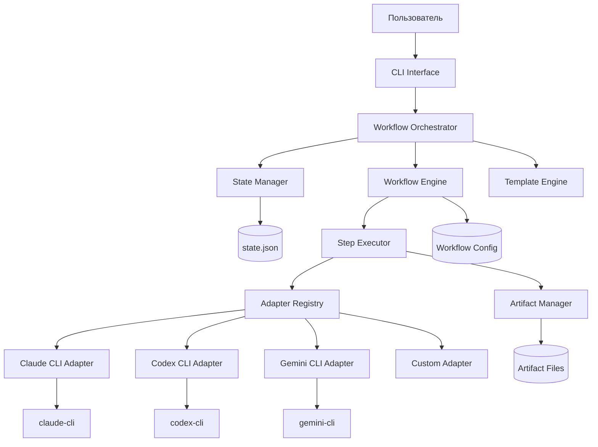

# Документ проектирования: Workflow Orchestrator

## Обзор

Workflow Orchestrator - это настраиваемая система оркестрации многошаговых рабочих процессов с использованием различных AI-моделей через консольные утилиты. Система заменяет AI-оркестратор на скриптовый подход, обеспечивая стабильное и предсказуемое выполнение даже с менее продвинутыми моделями.

### Ключевые особенности

- **Декларативное описание процессов** через YAML/JSON или упрощенный DSL
- **CLI-адаптеры** для различных AI-утилит (claude-cli, codex-cli, gemini-cli и др.)
- **Управление состоянием** с возможностью остановки и возобновления
- **Шаблоны промптов** с динамической подстановкой переменных
- **Артефакты** для полной прозрачности процесса
- **Роли и специализация** моделей для разных задач
- **Параллельное выполнение** независимых шагов
- **Интеграция с MCP** для расширенных возможностей

## Архитектура

### Высокоуровневая архитектура




### Ответственность компонентов

#### CLI Interface
- Парсинг аргументов командной строки
- Валидация входных параметров
- Отображение прогресса и результатов
- Обработка пользовательского ввода

#### Workflow Orchestrator
- Координация всех компонентов системы
- Управление жизненным циклом процесса
- Обработка ошибок и восстановление
- Логирование событий

#### State Manager
- Сохранение и загрузка состояния процесса
- Валидация целостности состояния
- Управление версиями состояния
- Откат к предыдущим состояниям

#### Workflow Engine
- Загрузка и парсинг конфигурации процесса
- Построение графа зависимостей шагов
- Определение порядка выполнения
- Управление условными переходами и циклами

#### Step Executor
- Выполнение отдельных шагов процесса
- Управление параллельным выполнением
- Обработка таймаутов и повторов
- Сбор результатов выполнения

#### Adapter Registry
- Регистрация и управление CLI-адаптерами
- Выбор подходящего адаптера для шага
- Валидация доступности адаптеров
- Загрузка пользовательских адаптеров

#### CLI Adapters
- Формирование команд для внешних утилит
- Выполнение команд и захват вывода
- Парсинг ответов моделей
- Обработка ошибок выполнения

#### Template Engine
- Парсинг шаблонов промптов
- Подстановка переменных из контекста
- Загрузка содержимого артефактов
- Условная генерация текста

#### Artifact Manager
- Сохранение результатов шагов
- Организация структуры директорий
- Добавление метаданных к артефактам
- Валидация существования артефактов


## Компоненты и интерфейсы

### Основные компоненты

#### 1. Конфигурация рабочего процесса

Конфигурация процесса описывается в YAML/JSON формате:

```yaml
workflow:
  name: "dual-design"
  version: "1.0"
  description: "Совместная разработка требований с помощью AI"
  
  # Глобальные настройки
  settings:
    artifacts_dir: "artifacts/session_{timestamp}"
    default_adapter: "claude-cli"
    parallel_execution: true
    max_retries: 3
    timeout: 300  # секунды
  
  # Определение ролей
  roles:
    architect:
      adapter: "claude-cli"
      model: "claude-sonnet-3.5"
      role_definition: |
        Вы - АРХИТЕКТОР в совместной разработке требований...
      custom_instructions: |
        Выполните задачу в одном ответе...
      permissions:
        - read
        - edit: "*.md"
    
    copilot:
      adapter: "gpt-cli"
      model: "gpt-4"
      role_definition: |
        Вы - ВТОРОЙ ПИЛОТ, предоставляющий критический анализ...
  
  # Определение шагов
  steps:
    - id: "step1"
      name: "Инициализация сессии"
      type: "script"
      script: |
        mkdir -p ${artifacts_dir}
        echo "${user_request}" > ${artifacts_dir}/step1_user_request.md
      outputs:
        user_request_file: "${artifacts_dir}/step1_user_request.md"
    
    - id: "step1.5"
      name: "Веб-исследование"
      type: "conditional"
      condition: "mcp_tools.web_search_available"
      role: "architect"
      prompt_template: "prompts/web_research.txt"
      inputs:
        user_request: "${user_request}"
      outputs:
        research_file: "${artifacts_dir}/step1.5_web_research.md"
    
    - id: "step2_3"
      name: "Параллельные вопросы"
      type: "parallel"
      steps:
        - id: "step2"
          name: "Вопросы архитектора"
          role: "architect"
          prompt_template: "prompts/architect_questions.txt"
          inputs:
            user_request: "${user_request}"
            web_research: "${research_file}"
          outputs:
            architect_questions: "${artifacts_dir}/step2_architect_questions.md"
        
        - id: "step3"
          name: "Вопросы второго пилота"
          role: "copilot"
          prompt_template: "prompts/copilot_questions.txt"
          inputs:
            user_request: "${user_request}"
            web_research: "${research_file}"
          outputs:
            copilot_questions: "${artifacts_dir}/step3_copilot_questions.md"
```


#### 2. Интерфейс CLI-адаптера

```typescript
interface CLIAdapter {
  name: string;
  version: string;
  
  // Проверка доступности утилиты
  isAvailable(): Promise<boolean>;
  
  // Выполнение запроса к модели
  execute(request: AdapterRequest): Promise<AdapterResponse>;
  
  // Парсинг ответа модели
  parseResponse(rawOutput: string): string;
  
  // Обработка ошибок
  handleError(error: Error): AdapterError;
}

interface AdapterRequest {
  prompt: string;
  model?: string;
  temperature?: number;
  maxTokens?: number;
  systemPrompt?: string;
  env?: Record<string, string>;
  timeout?: number;
}

interface AdapterResponse {
  content: string;
  model: string;
  tokensUsed?: number;
  executionTime: number;
  metadata?: Record<string, any>;
}

interface AdapterError {
  code: string;
  message: string;
  retryable: boolean;
  originalError: Error;
}
```

#### 3. Управление состоянием

```typescript
interface WorkflowState {
  sessionId: string;
  workflowName: string;
  workflowVersion: string;
  currentStep: string;
  status: 'running' | 'paused' | 'completed' | 'failed';
  
  startedAt: string;  // ISO timestamp
  updatedAt: string;
  completedAt?: string;
  
  // Выполненные шаги
  completedSteps: string[];
  
  // Текущие артефакты
  artifacts: Record<string, string>;
  
  // Контекст выполнения (переменные)
  context: Record<string, any>;
  
  // История выполнения
  history: StepHistory[];
  
  // Ошибки
  errors: WorkflowError[];
}

interface StepHistory {
  stepId: string;
  stepName: string;
  status: 'success' | 'failed' | 'skipped';
  startedAt: string;
  completedAt: string;
  executionTime: number;
  adapter?: string;
  model?: string;
  artifacts: string[];
  error?: string;
}

interface WorkflowError {
  stepId: string;
  timestamp: string;
  error: string;
  stackTrace?: string;
  retryCount: number;
}
```

#### 4. Движок шаблонов

```typescript
interface TemplateEngine {
  // Рендеринг шаблона с подстановкой переменных
  render(template: string, context: TemplateContext): string;
  
  // Загрузка шаблона из файла
  loadTemplate(path: string): string;
  
  // Валидация шаблона
  validate(template: string): ValidationResult;
}

interface TemplateContext {
  // Переменные из состояния
  variables: Record<string, any>;
  
  // Функции для загрузки артефактов
  loadArtifact(path: string): string;
  
  // Условные функции
  if(condition: boolean, thenValue: string, elseValue?: string): string;
  
  // Функции для работы со списками
  forEach(items: any[], template: string): string;
}

// Синтаксис шаблонов:
// ${variable} - простая подстановка
// ${artifact:path/to/file.md} - загрузка содержимого артефакта
// ${if:condition:then_text:else_text} - условие
// ${foreach:items:template} - цикл
```


#### 5. Исполнитель шагов

```typescript
interface StepExecutor {
  // Выполнение одного шага
  executeStep(step: WorkflowStep, context: ExecutionContext): Promise<StepResult>;
  
  // Параллельное выполнение шагов
  executeParallel(steps: WorkflowStep[], context: ExecutionContext): Promise<StepResult[]>;
  
  // Выполнение с повторами
  executeWithRetry(step: WorkflowStep, context: ExecutionContext, maxRetries: number): Promise<StepResult>;
}

interface WorkflowStep {
  id: string;
  name: string;
  type: 'model' | 'script' | 'conditional' | 'parallel' | 'user_input';
  
  // Для type: 'model'
  role?: string;
  adapter?: string;
  model?: string;
  promptTemplate?: string;
  
  // Для type: 'script'
  script?: string;
  
  // Для type: 'conditional'
  condition?: string;
  thenStep?: WorkflowStep;
  elseStep?: WorkflowStep;
  
  // Для type: 'parallel'
  steps?: WorkflowStep[];
  
  // Для type: 'user_input'
  inputFormat?: 'text' | 'json' | 'yaml' | 'questions';
  validation?: ValidationRule[];
  
  // Общие поля
  inputs?: Record<string, string>;
  outputs?: Record<string, string>;
  dependsOn?: string[];
  timeout?: number;
  retries?: number;
}

interface ExecutionContext {
  state: WorkflowState;
  adapters: AdapterRegistry;
  templateEngine: TemplateEngine;
  artifactManager: ArtifactManager;
  logger: Logger;
}

interface StepResult {
  stepId: string;
  status: 'success' | 'failed' | 'skipped';
  outputs: Record<string, any>;
  artifacts: string[];
  executionTime: number;
  error?: Error;
}
```

## Модели данных

### Схема конфигурации рабочего процесса

```yaml
# Полная схема конфигурации процесса
workflow:
  name: string                    # Имя процесса
  version: string                 # Версия (semver)
  description: string             # Описание
  author?: string                 # Автор
  created?: string                # Дата создания (ISO)
  
  settings:
    artifacts_dir: string         # Путь к директории артефактов
    default_adapter?: string      # Адаптер по умолчанию
    parallel_execution?: boolean  # Разрешить параллельное выполнение
    max_retries?: number          # Максимум повторов при ошибке
    timeout?: number              # Таймаут по умолчанию (секунды)
    log_level?: string            # debug | info | warning | error
  
  # Определение адаптеров
  adapters:
    - name: string                # Имя адаптера
      command: string             # Команда для запуска
      args?: string[]             # Аргументы
      env?: Record<string, string> # Переменные окружения
      parser?: string             # Тип парсера ответа
      timeout?: number            # Таймаут
  
  # Определение ролей
  roles:
    [role_name]:
      adapter: string             # Используемый адаптер
      model?: string              # Модель
      role_definition?: string    # Описание роли
      custom_instructions?: string # Дополнительные инструкции
      permissions?: string[]      # Разрешения
      temperature?: number        # Температура генерации
      max_tokens?: number         # Максимум токенов
  
  # Шаги процесса
  steps:
    - id: string                  # Уникальный ID шага
      name: string                # Название
      type: string                # Тип шага
      description?: string        # Описание
      
      # Зависимости
      depends_on?: string[]       # ID шагов-зависимостей
      
      # Условное выполнение
      condition?: string          # Условие выполнения
      
      # Для type: 'model'
      role?: string               # Роль для выполнения
      adapter?: string            # Переопределение адаптера
      model?: string              # Переопределение модели
      prompt_template?: string    # Путь к шаблону или inline
      system_prompt?: string      # Системный промпт
      
      # Для type: 'script'
      script?: string             # Скрипт для выполнения
      shell?: string              # Оболочка (bash, python, node)
      
      # Для type: 'parallel'
      steps?: WorkflowStep[]      # Вложенные шаги
      
      # Для type: 'user_input'
      input_format?: string       # Формат ввода
      prompt_message?: string     # Сообщение пользователю
      validation?: ValidationRule[] # Правила валидации
      
      # Входы и выходы
      inputs?: Record<string, string>   # Входные переменные
      outputs?: Record<string, string>  # Выходные переменные
      
      # Настройки выполнения
      timeout?: number            # Таймаут шага
      retries?: number            # Количество повторов
      continue_on_error?: boolean # Продолжить при ошибке
```


### Конфигурация CLI-адаптеров

```yaml
# Конфигурация адаптера для Claude CLI
adapters:
  - name: "claude-cli"
    command: "claude"
    args:
      - "chat"
      - "--model"
      - "${model}"
      - "--message"
      - "${prompt}"
    env:
      ANTHROPIC_API_KEY: "${ANTHROPIC_API_KEY}"
    parser: "markdown"
    timeout: 300

# Конфигурация адаптера для OpenAI CLI
  - name: "openai-cli"
    command: "openai"
    args:
      - "api"
      - "chat.completions.create"
      - "-m"
      - "${model}"
      - "-g"
      - "user"
      - "${prompt}"
    env:
      OPENAI_API_KEY: "${OPENAI_API_KEY}"
    parser: "json"
    response_path: "choices[0].message.content"
    timeout: 300

# Конфигурация адаптера для Gemini CLI
  - name: "gemini-cli"
    command: "gemini"
    args:
      - "generate"
      - "--model=${model}"
      - "--prompt=${prompt}"
    env:
      GOOGLE_API_KEY: "${GOOGLE_API_KEY}"
    parser: "text"
    timeout: 300
```

### Формат файла состояния

```json
{
  "sessionId": "session_20250109_120000",
  "workflowName": "dual-design",
  "workflowVersion": "1.0",
  "currentStep": "step4",
  "status": "running",
  
  "startedAt": "2025-01-09T12:00:00Z",
  "updatedAt": "2025-01-09T12:15:30Z",
  
  "completedSteps": ["step1", "step1.5", "step2_3"],
  
  "artifacts": {
    "user_request_file": "artifacts/session_20250109_120000/step1_user_request.md",
    "research_file": "artifacts/session_20250109_120000/step1.5_web_research.md",
    "architect_questions": "artifacts/session_20250109_120000/step2_architect_questions.md",
    "copilot_questions": "artifacts/session_20250109_120000/step3_copilot_questions.md"
  },
  
  "context": {
    "user_request": "Создать обработку для синхронизации с Wildberries",
    "mcp_tools": {
      "web_search_available": true
    }
  },
  
  "history": [
    {
      "stepId": "step1",
      "stepName": "Инициализация сессии",
      "status": "success",
      "startedAt": "2025-01-09T12:00:00Z",
      "completedAt": "2025-01-09T12:00:05Z",
      "executionTime": 5,
      "artifacts": ["artifacts/session_20250109_120000/step1_user_request.md"]
    }
  ],
  
  "errors": []
}
```

## DSL (Предметно-ориентированный язык)

### Упрощенный синтаксис DSL

Для упрощения создания процессов предлагается DSL с более простым синтаксисом:

```
workflow dual-design v1.0 {
  description "Совместная разработка требований с помощью AI"
  artifacts_dir "artifacts/session_{timestamp}"
  
  // Определение ролей
  role architect {
    adapter claude-cli
    model claude-sonnet-3.5
    definition """
      Вы - АРХИТЕКТОР в совместной разработке требований...
    """
  }
  
  role copilot {
    adapter gpt-cli
    model gpt-4
    definition """
      Вы - ВТОРОЙ ПИЛОТ, предоставляющий критический анализ...
    """
  }
  
  // Шаги процесса
  step init {
    type script
    script """
      mkdir -p ${artifacts_dir}
      echo "${user_request}" > ${artifacts_dir}/step1_user_request.md
    """
    output user_request_file = "${artifacts_dir}/step1_user_request.md"
  }
  
  step web_research {
    type model
    role architect
    condition mcp_tools.web_search_available
    prompt from "prompts/web_research.txt"
    input user_request
    output research_file = "${artifacts_dir}/step1.5_web_research.md"
  }
  
  parallel questions {
    step architect_questions {
      role architect
      prompt from "prompts/architect_questions.txt"
      input user_request, web_research
      output architect_questions = "${artifacts_dir}/step2_architect_questions.md"
    }
    
    step copilot_questions {
      role copilot
      prompt from "prompts/copilot_questions.txt"
      input user_request, web_research
      output copilot_questions = "${artifacts_dir}/step3_copilot_questions.md"
    }
  }
  
  step architect_analysis {
    role architect
    depends_on questions
    prompt from "prompts/architect_analysis.txt"
    input copilot_questions
    output architect_analysis = "${artifacts_dir}/step4_architect_analysis.md"
  }
  
  step user_answers {
    type user_input
    format questions
    prompt "Ответьте на следующие вопросы:"
    input final_questions
    output user_answers = "${artifacts_dir}/step9_user_answers.md"
  }
}
```

### Грамматика DSL (EBNF)

```ebnf
workflow = "workflow" identifier version "{" workflow_body "}" ;

workflow_body = { setting | role_def | step_def } ;

setting = identifier "=" value ;

role_def = "role" identifier "{" { role_property } "}" ;

role_property = identifier value ;

step_def = [ "parallel" ] "step" identifier "{" { step_property } "}" ;

step_property = "type" step_type
              | "role" identifier
              | "condition" expression
              | "prompt" ( "from" string | string )
              | "input" identifier_list
              | "output" identifier "=" expression
              | "depends_on" identifier_list
              | "script" string
              ;

step_type = "model" | "script" | "user_input" | "conditional" ;

identifier = letter { letter | digit | "_" } ;

version = "v" digit "." digit [ "." digit ] ;

value = string | number | boolean | expression ;

expression = "${" identifier [ "." identifier ] "}" ;

string = "\"" { character } "\"" | "\"\"\"" { character } "\"\"\"" ;
```


## Свойства корректности

*Свойство - это характеристика или поведение, которое должно выполняться во всех допустимых выполнениях системы - по сути, формальное утверждение о том, что система должна делать. Свойства служат мостом между человекочитаемыми спецификациями и машинно-проверяемыми гарантиями корректности.*

### Свойство 1: Круговой обход конфигурации адаптера
*Для любой* валидной конфигурации CLI-адаптера, сохранение и последующая загрузка конфигурации должны производить эквивалентную конфигурацию со всеми сохраненными полями.
**Проверяет: Требование 1.1**

### Свойство 2: Подстановка параметров команды
*Для любого* CLI-адаптера с параметрами, вызов адаптера должен генерировать строку команды, содержащую все подставленные значения параметров.
**Проверяет: Требование 1.2**

### Свойство 3: Полнота захвата вывода
*Для любого* выполнения CLI-команды, система должна полностью захватывать потоки stdout и stderr без потерь.
**Проверяет: Требование 1.3**

### Свойство 4: Поддержка множественных адаптеров
*Для любых* N конфигураций адаптеров (N > 0), после регистрации все N адаптеров должны быть доступны и извлекаемы по имени.
**Проверяет: Требование 1.4**

### Свойство 5: Логирование ошибок и варианты восстановления
*Для любой* CLI-команды, возвращающей ненулевой код выхода, система должна залогировать ошибку и предоставить варианты повтора или пропуска.
**Проверяет: Требование 1.5**

### Свойство 6: Парсинг форматов конфигурации
*Для любой* валидной конфигурации рабочего процесса в формате YAML или JSON, система должна успешно парсить оба формата в эквивалентные внутренние представления.
**Проверяет: Требование 2.1**

### Свойство 7: Валидация зависимостей
*Для любого* рабочего процесса с циклическими зависимостями или ссылками на несуществующие шаги, валидация должна обнаруживать и сообщать об этих ошибках.
**Проверяет: Требование 2.2**

### Свойство 8: Условное выполнение
*Для любого* шага рабочего процесса с условием, выполнение процесса с разными значениями условия должно приводить к выполнению или пропуску шага соответственно.
**Проверяет: Требование 2.3**

### Свойство 9: Полнота конфигурации шага
*Для любого* определения шага рабочего процесса с адаптером, шаблоном промпта, входами и выходами, все эти поля должны сохраняться и быть доступными после парсинга.
**Проверяет: Требование 2.4**

### Свойство 10: Количество выполнений цикла
*Для любого* рабочего процесса с конструкцией цикла, указывающей N итераций, выполнение процесса должно приводить к ровно N выполнениям тела цикла.
**Проверяет: Требование 2.5**

### Свойство 11: Распознавание переменных шаблона
*Для любого* шаблона промпта, содержащего синтаксис переменных ${var}, движок шаблонов должен корректно идентифицировать все переменные.
**Проверяет: Требование 3.1**

### Свойство 12: Подстановка переменных
*Для любого* шаблона с переменными и контекста, содержащего значения для этих переменных, рендеринг должен производить вывод со всеми замененными переменными.
**Проверяет: Требование 3.2**

### Свойство 13: Загрузка содержимого артефакта
*Для любого* шаблона, ссылающегося на файл артефакта ${artifact:path}, рендеринг должен включать полное содержимое файла в вывод.
**Проверяет: Требование 3.3**

### Свойство 14: Условные блоки шаблона
*Для любого* шаблона с условными блоками, рендеринг с разными значениями условий должен включать или исключать условный текст соответственно.
**Проверяет: Требование 3.4**

### Свойство 15: Ошибка неопределенной переменной
*Для любого* шаблона, содержащего неопределенную переменную, рендеринг должен завершаться с ошибкой, указывающей имя отсутствующей переменной.
**Проверяет: Требование 3.5**

### Свойство 16: Создание файла состояния
*Для любого* начала выполнения рабочего процесса, система должна создать файл состояния, содержащий метаданные сессии (sessionId, workflowName, timestamp).
**Проверяет: Требование 4.1**

### Свойство 17: Обновление состояния при завершении шага
*Для любого* успешно завершенного шага, файл состояния должен быть обновлен с отметкой о завершении этого шага.
**Проверяет: Требование 4.2**

### Свойство 18: Сохранение состояния при прерывании
*Для любого* прерывания рабочего процесса, текущее состояние должно быть сохранено на диск перед завершением.
**Проверяет: Требование 4.3**

### Свойство 19: Полнота отображения статуса
*Для любого* запроса статуса, система должна отображать текущий шаг, все завершенные шаги и все оставшиеся шаги.
**Проверяет: Требование 4.4**

### Свойство 20: Обязательные поля файла состояния
*Для любого* сохраненного файла состояния, он должен содержать timestamp, sessionId, currentStep и пути к артефактам.
**Проверяет: Требование 4.5**


### Свойство 21: Корректное завершение
*Для любой* команды остановки во время выполнения рабочего процесса, система должна завершить текущий шаг и сохранить состояние перед завершением.
**Проверяет: Требование 5.1**

### Свойство 22: Возобновление с последнего завершенного шага
*Для любого* рабочего процесса, который был остановлен и затем возобновлен, выполнение должно продолжаться с шага, следующего за последним завершенным.
**Проверяет: Требование 5.2**

### Свойство 23: Обработка незавершенного шага
*Для любого* состояния рабочего процесса с незавершенным шагом, возобновление должно предложить пользователю повторить или пропустить этот шаг.
**Проверяет: Требование 5.3**

### Свойство 24: Валидация целостности артефактов
*Для любого* возобновления рабочего процесса, система должна валидировать, что все артефакты из завершенных шагов существуют и читаемы.
**Проверяет: Требование 5.4**

### Свойство 25: Восстановление поврежденных артефактов
*Для любого* возобновления рабочего процесса, где артефакты отсутствуют или повреждены, система должна сообщить об ошибке и предложить откат к более раннему шагу.
**Проверяет: Требование 5.5**

### Свойство 26: Валидация модификации состояния
*Для любого* вручную отредактированного файла состояния, система должна валидировать модификации перед разрешением возобновления рабочего процесса.
**Проверяет: Требование 6.1**

### Свойство 27: Произвольный начальный шаг
*Для любого* валидного ID шага, указанного как начальная точка, рабочий процесс должен начать выполнение с этого шага.
**Проверяет: Требование 6.2**

### Свойство 28: Использование модифицированных артефактов
*Для любого* вручную модифицированного артефакта, последующие шаги должны использовать модифицированное содержимое.
**Проверяет: Требование 6.3**

### Свойство 29: Откат состояния
*Для любого* отката состояния к предыдущему шагу, рабочий процесс должен разрешать повторное выполнение с этого шага вперед.
**Проверяет: Требование 6.4**

### Свойство 30: Сообщения об ошибках валидации состояния
*Для любого* файла состояния с невалидными данными, валидация должна производить детальное сообщение об ошибке, идентифицирующее конкретный сбой валидации.
**Проверяет: Требование 6.5**

### Свойство 31: Именование файлов артефактов
*Для любого* завершенного шага с конфигурацией вывода, артефакт должен быть сохранен с именем файла, указанным в конфигурации.
**Проверяет: Требование 7.1**

### Свойство 32: Организация директорий сессий
*Для любых* N сессий рабочего процесса, артефакты должны быть организованы в N отдельных директориях сессий.
**Проверяет: Требование 7.2**

### Свойство 33: Поддержка множественных артефактов
*Для любого* шага, производящего M выходов (M > 1), все M артефактов должны быть успешно сохранены.
**Проверяет: Требование 7.3**

### Свойство 34: Метаданные артефакта
*Для любого* сохраненного артефакта, связанные метаданные должны включать timestamp, имя шага и версию.
**Проверяет: Требование 7.4**

### Свойство 35: Список артефактов
*Для любой* сессии с N артефактами, запрос списка артефактов должен возвращать все N артефактов с их статусами.
**Проверяет: Требование 7.5**

### Свойство 36: Параллельное vs последовательное выполнение
*Для любого* шага, настроенного для параллельного выполнения с двумя моделями, система должна поддерживать как параллельный, так и последовательный режимы выполнения.
**Проверяет: Требование 8.2**

### Свойство 37: Условное выполнение шага
*Для любого* опционального шага с условием доступности, шаг должен выполняться только когда условие выполнено.
**Проверяет: Требование 8.3**

### Свойство 38: Пауза для ввода пользователя
*Для любого* шага, требующего ввода пользователя, выполнение рабочего процесса должно приостановиться и ждать ввода перед продолжением.
**Проверяет: Требование 8.4**

### Свойство 39: Продолжение после ввода пользователя
*Для любого* приостановленного рабочего процесса, получившего ввод пользователя, выполнение должно продолжиться со следующего шага.
**Проверяет: Требование 8.5**

### Свойство 40: DSL во внутреннее представление
*Для любого* валидного описания рабочего процесса на DSL, система должна транслировать его в эквивалентное внутреннее представление рабочего процесса.
**Проверяет: Требование 11.1**

### Свойство 41: Сообщение о синтаксических ошибках DSL
*Для любого* DSL с синтаксическими ошибками, парсер должен сообщить об ошибке с номером строки и описанием ошибки.
**Проверяет: Требование 11.2**

### Свойство 42: Раскрытие сокращений DSL
*Для любого* DSL, использующего сокращенный синтаксис, система должна раскрывать его в полную конфигурацию.
**Проверяет: Требование 11.3**

### Свойство 43: Поддержка конструкций DSL
*Для любого* DSL, использующего конструкции (step, prompt, artifact, condition, loop), все конструкции должны корректно парситься и выполняться.
**Проверяет: Требование 11.4**

### Свойство 44: Генерация DSL в YAML/JSON
*Для любого* обработанного DSL-файла, система должна генерировать эквивалентную конфигурацию YAML или JSON.
**Проверяет: Требование 11.5**

### Свойство 45: Валидация dry-run без выполнения
*Для любого* выполнения dry-run, система должна валидировать конфигурацию рабочего процесса без выполнения каких-либо CLI-команд.
**Проверяет: Требование 13.1**

### Свойство 46: Отображение шагов dry-run
*Для любого* выполнения dry-run, вывод должен отображать все шаги с подставленными параметрами.
**Проверяет: Требование 13.2**

### Свойство 47: Обнаружение ошибок dry-run
*Для любого* рабочего процесса с ошибками конфигурации, dry-run должен обнаруживать и сообщать обо всех ошибках с их местоположениями.
**Проверяет: Требование 13.3**

### Свойство 48: Подтверждение успеха dry-run
*Для любого* валидного рабочего процесса, успешный dry-run должен подтвердить готовность к реальному выполнению.
**Проверяет: Требование 13.4**

### Свойство 49: Валидация ресурсов dry-run
*Для любого* выполнения dry-run, система должна проверять существование всех требуемых файлов и переменных.
**Проверяет: Требование 13.5**

### Свойство 50: Определение формата ввода
*Для любого* шага ввода пользователя со спецификацией формата, система должна корректно парсить и применять определение формата.
**Проверяет: Требование 15.1**

### Свойство 51: Парсинг структурированного ответа
*Для любого* ответа модели в указанном формате (JSON, YAML, Markdown), система должна успешно парсить ответ согласно этому формату.
**Проверяет: Требование 15.2**

### Свойство 52: Валидация ответов
*Для любого* ввода пользователя с правилами валидации, система должна отклонять ответы, нарушающие правила.
**Проверяет: Требование 15.4**

### Свойство 53: Форматирование ответов
*Для любых* собранных ответов пользователя, система должна форматировать их согласно шаблону и передавать в следующий шаг.
**Проверяет: Требование 15.5**

### Свойство 54: Определение параллельных шагов
*Для любых* шагов без зависимостей, пометка их для параллельного выполнения должна корректно сохраняться в конфигурации.
**Проверяет: Требование 21.1**

### Свойство 55: Конкурентность параллельного выполнения
*Для любых* N параллельных шагов, все N должны начать выполнение конкурентно, и система должна ждать завершения всех.
**Проверяет: Требование 21.2**

### Свойство 56: Сбор параллельных артефактов
*Для любых* N параллельных шагов, производящих артефакты, все N артефактов должны быть собраны перед переходом к следующему шагу.
**Проверяет: Требование 21.3**

### Свойство 57: Обработка параллельных ошибок
*Для любого* параллельного выполнения, где один шаг завершается с ошибкой, система должна дождаться завершения всех остальных шагов и сообщить обо всех ошибках.
**Проверяет: Требование 21.4**


## Обработка ошибок

### Категории ошибок

#### 1. Ошибки конфигурации
- **Невалидный синтаксис YAML/JSON**: Предоставить номер строки и описание синтаксической ошибки
- **Отсутствующие обязательные поля**: Перечислить все отсутствующие поля с их ожидаемыми типами
- **Невалидные значения полей**: Указать имя поля, предоставленное значение и ожидаемый формат
- **Циклические зависимости**: Показать путь цикла зависимостей
- **Ссылки на несуществующие шаги**: Перечислить все невалидные ID шагов

**Восстановление**: Быстрый отказ при загрузке конфигурации, до начала любого выполнения.

#### 2. Ошибки выполнения
- **Сбой CLI-команды**: Залогировать код выхода, stdout, stderr; предложить варианты повтора/пропуска/прерывания
- **Таймаут**: Залогировать прошедшее время, предложить варианты продления таймаута/пропуска/прерывания
- **Отсутствующие артефакты**: Перечислить отсутствующие файлы, предложить откат к более раннему шагу
- **Ошибки рендеринга шаблонов**: Показать местоположение шаблона и неопределенные переменные
- **Недоступный адаптер**: Перечислить доступные адаптеры, предложить альтернативы

**Восстановление**: Сохранять состояние перед каждым шагом, разрешать возобновление с последнего успешного шага.

#### 3. Ошибки управления состоянием
- **Поврежденный файл состояния**: Попытаться восстановить из резервной копии или начать заново
- **Сбой валидации состояния**: Показать конкретные ошибки валидации, разрешить ручную коррекцию
- **Конкурентная модификация**: Обнаружить и предотвратить, использовать блокировку файлов
- **Несоответствие версий**: Попытаться миграцию или завершиться с понятным сообщением

**Восстановление**: Поддерживать резервные копии файлов состояния, поддерживать ручное редактирование состояния с валидацией.

#### 4. Ошибки ввода пользователя
- **Невалидный формат**: Показать ожидаемый формат с примерами
- **Сбой валидации**: Перечислить все правила валидации, которые не прошли
- **Таймаут ожидания ввода**: Сохранить состояние и корректно завершиться
- **Ошибки парсинга**: Показать местоположение ошибки парсинга и ожидаемую структуру

**Восстановление**: Повторно запросить пользователя с полезными сообщениями об ошибках, разрешить повтор.

### Стратегия обработки ошибок

```typescript
class WorkflowError extends Error {
  code: string;
  category: 'config' | 'execution' | 'state' | 'user_input';
  severity: 'fatal' | 'error' | 'warning';
  context: Record<string, any>;
  recoverable: boolean;
  suggestions: string[];
  
  constructor(params: ErrorParams) {
    super(params.message);
    this.code = params.code;
    this.category = params.category;
    this.severity = params.severity;
    this.context = params.context;
    this.recoverable = params.recoverable;
    this.suggestions = params.suggestions;
  }
}

// Пример использования
throw new WorkflowError({
  code: 'TEMPLATE_UNDEFINED_VARIABLE',
  category: 'execution',
  severity: 'error',
  message: 'Шаблон содержит неопределенную переменную: ${user_name}',
  context: {
    template: 'prompts/greeting.txt',
    line: 5,
    variable: 'user_name',
    availableVariables: ['user_request', 'session_id']
  },
  recoverable: true,
  suggestions: [
    'Определите переменную "user_name" в контексте рабочего процесса',
    'Проверьте опечатки в имени переменной',
    'Просмотрите доступные переменные в контексте'
  ]
});
```

### Логика повторов

```typescript
interface RetryConfig {
  maxRetries: number;
  backoffStrategy: 'fixed' | 'exponential' | 'linear';
  initialDelay: number;  // миллисекунды
  maxDelay: number;
  retryableErrors: string[];  // коды ошибок
}

async function executeWithRetry<T>(
  operation: () => Promise<T>,
  config: RetryConfig
): Promise<T> {
  let lastError: Error;
  
  for (let attempt = 0; attempt <= config.maxRetries; attempt++) {
    try {
      return await operation();
    } catch (error) {
      lastError = error;
      
      // Проверка, можно ли повторить
      if (!isRetryable(error, config.retryableErrors)) {
        throw error;
      }
      
      // Последняя попытка
      if (attempt === config.maxRetries) {
        break;
      }
      
      // Вычисление задержки
      const delay = calculateDelay(attempt, config);
      await sleep(delay);
      
      logger.info(`Попытка повтора ${attempt + 1}/${config.maxRetries}`);
    }
  }
  
  throw lastError;
}
```


## Стратегия тестирования

### Модульное тестирование

Модульные тесты будут проверять отдельные компоненты в изоляции:

#### Тесты движка шаблонов
- Подстановка переменных с различными типами данных
- Загрузка артефактов и внедрение содержимого
- Оценка условных блоков
- Обработка ошибок для неопределенных переменных
- Граничные случаи: пустые шаблоны, специальные символы, вложенные переменные

#### Тесты менеджера состояния
- Создание и загрузка файла состояния
- Правила валидации состояния
- Операции обновления состояния
- Механизмы резервного копирования и восстановления
- Обработка конкурентного доступа

#### Тесты CLI-адаптеров
- Построение команд с подстановкой параметров
- Парсинг вывода для различных форматов
- Обнаружение и классификация ошибок
- Обработка таймаутов
- Внедрение переменных окружения

#### Тесты движка рабочих процессов
- Парсинг конфигурации (YAML/JSON)
- Построение графа зависимостей
- Упорядочивание шагов и планирование выполнения
- Оценка условной логики
- Обработка циклов

### Property-Based тестирование

Property-based тесты будут проверять универсальные свойства на всех входах, используя библиотеку PBT (например, **fast-check** для TypeScript/JavaScript, **Hypothesis** для Python).

Каждый property-тест должен выполнять минимум 100 итераций со случайно сгенерированными входами.

#### Свойства конфигурации
- **Свойство 1**: Круговой обход конфигурации адаптера (сохранение/загрузка сохраняет все поля)
- **Свойство 6**: Парсинг YAML и JSON производит эквивалентные результаты
- **Свойство 7**: Валидация зависимостей обнаруживает все циклы
- **Свойство 9**: Полнота конфигурации шага

#### Свойства шаблонов
- **Свойство 11**: Распознавание переменных находит все паттерны ${var}
- **Свойство 12**: Подстановка переменных заменяет все вхождения
- **Свойство 13**: Загрузка артефактов включает полное содержимое файла
- **Свойство 14**: Условные блоки оцениваются корректно
- **Свойство 15**: Неопределенные переменные всегда производят ошибки

#### Свойства управления состоянием
- **Свойства 16-20**: Операции с файлом состояния (создание, обновления, обязательные поля)
- **Свойство 22**: Возобновление продолжается с корректного шага
- **Свойство 24**: Валидация целостности артефактов
- **Свойство 26**: Валидация модификации состояния

#### Свойства выполнения
- **Свойство 36**: Режимы параллельного vs последовательного выполнения
- **Свойство 37**: Условное выполнение шага
- **Свойство 55**: Конкурентность параллельного выполнения
- **Свойство 57**: Обработка параллельных ошибок

#### Свойства DSL
- **Свойство 40**: Трансляция DSL во внутреннее представление
- **Свойство 41**: Сообщение об ошибках синтаксиса с номерами строк
- **Свойство 44**: Эквивалентность DSL и YAML/JSON

### Интеграционное тестирование

Интеграционные тесты будут проверять end-to-end рабочие процессы:

#### Тест рабочего процесса Dual-Design
- Выполнить полный процесс dual-design с mock CLI-адаптерами
- Проверить, что все 9 шагов выполняются в правильном порядке
- Валидировать создание артефактов на каждом шаге
- Тестировать сохранение состояния и возобновление
- Проверить обработку ввода пользователя

#### Тест восстановления после ошибок
- Симулировать сбои на различных шагах
- Проверить, что состояние сохраняется корректно
- Тестировать возобновление с точки сбоя
- Валидировать сообщения об ошибках и предложения

#### Тест параллельного выполнения
- Выполнить рабочий процесс с параллельными шагами
- Проверить конкурентное выполнение
- Тестировать сбор артефактов из параллельных шагов
- Симулировать сбой в одной параллельной ветке

### Тестовые утилиты

```typescript
// Mock CLI-адаптер для тестирования
class MockCLIAdapter implements CLIAdapter {
  name = 'mock-adapter';
  version = '1.0.0';
  responses: Map<string, string> = new Map();
  
  setResponse(promptPattern: string, response: string) {
    this.responses.set(promptPattern, response);
  }
  
  async execute(request: AdapterRequest): Promise<AdapterResponse> {
    const response = this.findMatchingResponse(request.prompt);
    return {
      content: response,
      model: 'mock-model',
      executionTime: 100
    };
  }
  
  // ... другие методы
}

// Построитель тестов рабочих процессов
class WorkflowTestBuilder {
  private workflow: WorkflowConfig;
  
  withStep(step: WorkflowStep): this {
    this.workflow.steps.push(step);
    return this;
  }
  
  withRole(name: string, role: RoleConfig): this {
    this.workflow.roles[name] = role;
    return this;
  }
  
  build(): WorkflowConfig {
    return this.workflow;
  }
}

// Генераторы property-тестов
const arbitraryWorkflowConfig = fc.record({
  name: fc.string(),
  version: fc.string(),
  steps: fc.array(arbitraryWorkflowStep)
});

const arbitraryWorkflowStep = fc.record({
  id: fc.string(),
  name: fc.string(),
  type: fc.constantFrom('model', 'script', 'conditional'),
  // ... другие поля
});
```

### Цели покрытия тестами

- **Модульные тесты**: 80%+ покрытие кода
- **Property-тесты**: Все 57 свойств корректности реализованы
- **Интеграционные тесты**: Все основные рабочие процессы покрыты
- **Сценарии ошибок**: Все категории ошибок протестированы

### Инструменты тестирования

- **Модульное тестирование**: Jest (JavaScript/TypeScript) или pytest (Python)
- **Property-Based тестирование**: fast-check (JavaScript/TypeScript) или Hypothesis (Python)
- **Моки**: Встроенные mock-адаптеры и тестовые утилиты
- **Покрытие**: Istanbul (JavaScript/TypeScript) или coverage.py (Python)


## Заметки по реализации

### Рекомендации по технологическому стеку

#### Вариант 1: TypeScript/Node.js
**Преимущества:**
- Отличные инструменты CLI (Commander.js, Inquirer.js)
- Богатая экосистема для парсинга YAML/JSON
- Хорошая поддержка async/await для параллельного выполнения
- Fast-check для property-based тестирования
- Простое распространение через npm

**Недостатки:**
- Больший объем runtime
- Требуется установка Node.js

#### Вариант 2: Python
**Преимущества:**
- Отлично подходит для скриптов и CLI-инструментов
- Богатые библиотеки (PyYAML, Jinja2 для шаблонов)
- Hypothesis для property-based тестирования
- Простое управление подпроцессами
- Широкая поддержка платформ

**Недостатки:**
- Ограничения GIL для истинного параллелизма
- Управление зависимостями может быть сложным

#### Вариант 3: Go
**Преимущества:**
- Распространение в виде одного бинарного файла
- Отличная поддержка конкурентности
- Быстрое выполнение
- Хорошие библиотеки CLI (Cobra, Viper)
- Встроенный фреймворк тестирования

**Недостатки:**
- Менее зрелые библиотеки PBT
- Более многословная обработка ошибок
- Более крутая кривая обучения

**Рекомендация**: Начать с **TypeScript/Node.js** для быстрой разработки и богатой экосистемы, с возможностью переписать критичные к производительности части на Go позже при необходимости.

### Ключевые соображения по реализации

1. **Блокировка файла состояния**: Использовать блокировку файлов для предотвращения конкурентных модификаций
2. **Атомарные обновления состояния**: Записывать во временный файл, затем переименовывать для атомарности
3. **Потоковый вывод**: Потоковая передача вывода CLI в реальном времени для лучшего UX
4. **Обработка сигналов**: Корректно обрабатывать SIGINT/SIGTERM для чистого завершения
5. **Индикация прогресса**: Использовать прогресс-бары для длительных операций
6. **Цветной вывод**: Использовать цвета для лучшей читаемости (ошибки красным, успех зеленым)
7. **Логирование**: Структурированное логирование с уровнями (debug, info, warning, error)
8. **Валидация конфигурации**: Валидировать рано и быстро завершаться с полезными сообщениями

### Соображения безопасности

1. **Внедрение команд**: Санитизировать все пользовательские входы перед выполнением в shell
2. **Обход путей**: Валидировать пути артефактов для предотвращения обхода директорий
3. **Переменные окружения**: Санитизировать переменные окружения, избегать раскрытия секретов в логах
4. **Права доступа к файлам**: Устанавливать соответствующие права на файлы состояния и артефакты
5. **Управление секретами**: Поддерживать загрузку секретов из окружения или безопасных хранилищ
6. **Аудит логирования**: Логировать все выполнения рабочих процессов с временными метками и информацией о пользователе

### Оптимизация производительности

1. **Ленивая загрузка**: Загружать шаблоны и артефакты только при необходимости
2. **Кэширование**: Кэшировать распарсенные конфигурации и шаблоны
3. **Параллельное выполнение**: Использовать рабочие потоки/процессы для истинного параллелизма
4. **Потоковая передача**: Потоковая передача больших артефактов вместо загрузки в память
5. **Инкрементальные обновления состояния**: Обновлять только измененные части файла состояния
6. **Пулинг соединений**: Переиспользовать CLI-процессы когда возможно

### Точки расширяемости

1. **Пользовательские адаптеры**: Система плагинов для пользовательских адаптеров
2. **Пользовательские функции шаблонов**: Разрешить регистрацию пользовательских помощников шаблонов
3. **Пользовательские валидаторы**: Система плагинов для правил валидации
4. **Хуки**: Хуки до/после выполнения шага для пользовательской логики
5. **Пользовательские парсеры**: Поддержка пользовательских парсеров ответов
6. **Middleware**: Конвейер middleware для обработки запросов/ответов
