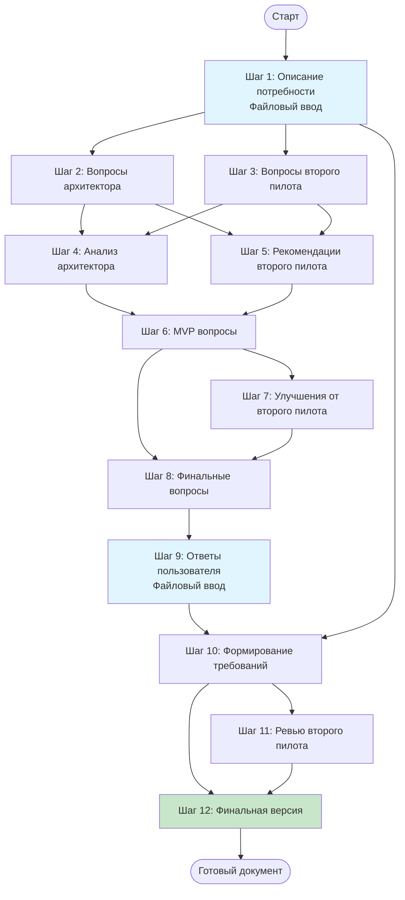

# Руководство по созданию бизнес-требований

Этот документ описывает два workflow для создания бизнес-требований с использованием файлового ввода.

## Визуальная схема процесса (полная версия)



## Доступные workflow

### 1. Полная версия (business-requirements-workflow.yaml)

Детальный процесс с участием двух AI-моделей для создания качественных требований.

**Особенности:**
- Совместная работа архитектора и второго пилота
- Многоэтапный анализ и уточнение вопросов
- Фокус на MVP (минимально жизнеспособный продукт)
- Критическое ревью требований
- Финальная версия с учетом всех замечаний

**Когда использовать:**
- Для сложных проектов
- Когда важна полнота и качество требований
- Когда есть время на детальный анализ

**Запуск:**
```bash
workflow-orchestrator run examples/business-requirements-workflow.yaml
```

### 2. Упрощенная версия (business-requirements-simple.yaml)

Быстрый процесс для создания базовых требований.

**Особенности:**
- Одна AI-модель
- Минимум шагов
- Быстрое получение результата
- Подходит для простых проектов

**Когда использовать:**
- Для простых проектов
- Когда нужен быстрый результат
- Для прототипирования идей

**Запуск:**
```bash
workflow-orchestrator run examples/business-requirements-simple.yaml
```

## Процесс работы (полная версия)

### Этап 1: Сбор информации

**Шаг 1: Описание потребности**
- Система создает файл-шаблон
- Открывает его в вашем редакторе
- Вы описываете свою идею или проблему
- Сохраняете и выбираете "Продолжить"

### Этап 2: Формирование вопросов

**Шаги 2-3: Параллельная генерация вопросов**
- Архитектор формирует свои вопросы
- Второй пилот формирует альтернативные вопросы
- Оба работают независимо

**Шаги 4-5: Взаимный анализ**
- Архитектор анализирует вопросы второго пилота
- Второй пилот дает рекомендации по вопросам архитектора
- Выявляются общие и уникальные аспекты

### Этап 3: Оптимизация для MVP

**Шаги 6-7: Фокус на MVP**
- Архитектор формирует вопросы для MVP
- Второй пилот предлагает упрощения
- Убираются избыточные вопросы

**Шаг 8: Финальные вопросы**
- Архитектор создает итоговый список
- Вопросы четко сформулированы и сгруппированы
- Добавлены пояснения и примеры

### Этап 4: Сбор ответов

**Шаг 9: Ответы пользователя**
- Система создает файл с вопросами
- Открывает его в редакторе
- Вы отвечаете на каждый вопрос
- Можете добавлять дополнительную информацию

### Этап 5: Создание требований

**Шаг 10: Формирование требований**
- Архитектор создает полный документ требований
- Включает все необходимые разделы
- Добавляет диаграммы Mermaid

**Шаг 11: Ревью**
- Второй пилот проводит критическое ревью
- Выявляет проблемы и пробелы
- Предлагает улучшения

**Шаг 12: Финальная версия**
- Архитектор создает итоговую версию
- Учитывает все замечания
- Готовый документ для использования

## Структура результата

Финальный документ включает:

### 1. Краткое описание проекта
- Цель проекта
- Целевая аудитория
- Ключевая ценность

### 2. Функциональные требования
- Основные функции (must-have)
- Дополнительные функции (nice-to-have)
- Детальное описание каждой функции

### 3. Нефункциональные требования
- Производительность
- Безопасность
- Масштабируемость
- Доступность

### 4. Сценарии использования
- User stories
- Пошаговые сценарии
- Альтернативные потоки

### 5. Сценарии тестирования
- Критерии приемки
- Тестовые случаи
- Граничные условия

### 6. Диаграммы взаимодействия
- Диаграммы последовательности (Mermaid)
- Диаграммы компонентов

### 7. Ограничения и зависимости
- Технические ограничения
- Бюджет и сроки
- Внешние зависимости

### 8. Критерии успеха
- Метрики
- KPI

## Советы по использованию

### Подготовка к запуску

1. **Настройте редактор**
   ```yaml
   settings:
     default_editor:
       command: "code"  # или vim, nano, notepad
       args: ["--wait"]
   ```

2. **Подготовьте информацию**
   - Соберите существующие документы
   - Подумайте о целях проекта
   - Определите ограничения

### Во время выполнения

1. **Будьте конкретны**
   - Избегайте общих фраз
   - Приводите примеры
   - Указывайте цифры где возможно

2. **Не спешите**
   - Используйте "Отложить" если нужно время
   - Можете вернуться позже
   - Процесс сохраняет состояние

3. **Добавляйте детали**
   - Не ограничивайтесь только ответами на вопросы
   - Добавляйте дополнительную информацию
   - Описывайте контекст

### После завершения

1. **Проверьте результат**
   - Прочитайте финальный документ
   - Убедитесь, что все важное учтено
   - Проверьте диаграммы

2. **Используйте как основу**
   - Документ готов к использованию
   - Можете дополнять его
   - Используйте для обсуждения с командой

## Примеры использования

### Пример 1: Веб-приложение

```bash
# Запуск
workflow-orchestrator run examples/business-requirements-workflow.yaml

# В первом файле опишите:
# - Идея: Платформа для управления задачами команды
# - Аудитория: Малые команды (5-15 человек)
# - Ограничения: Бюджет $5000, срок 3 месяца
```

### Пример 2: Мобильное приложение

```bash
# Запуск упрощенной версии для быстрого прототипа
workflow-orchestrator run examples/business-requirements-simple.yaml

# Опишите:
# - Идея: Приложение для отслеживания привычек
# - Аудитория: Люди, работающие над самосовершенствованием
# - Ограничения: iOS и Android, офлайн режим
```

### Пример 3: API сервис

```bash
# Запуск полной версии для детального анализа
workflow-orchestrator run examples/business-requirements-workflow.yaml

# Опишите:
# - Идея: REST API для интеграции с платежными системами
# - Аудитория: Разработчики e-commerce платформ
# - Ограничения: Высокая нагрузка, безопасность критична
```

## Возобновление процесса

Если вы выбрали "Отложить" на любом шаге:

```bash
# Проверьте ID сессии
ls artifacts/

# Возобновите процесс
workflow-orchestrator resume session_20260113_120000 \
  examples/business-requirements-workflow.yaml
```

Система автоматически:
- Найдет последний заполненный файл
- Продолжит с того места, где остановились
- Сохранит весь прогресс

## Настройка под себя

### Изменение моделей

```yaml
roles:
  architect:
    adapter: "openai-cli"  # Использовать OpenAI
    model: "gpt-4"
  
  copilot:
    adapter: "gemini-cli"  # Использовать Gemini
    model: "gemini-pro"
```

### Изменение формата файлов

```yaml
steps:
  - id: "user_need"
    input_mode: "file"
    file_format: "yaml"  # Вместо markdown
```

### Добавление своих шагов

Вы можете добавить дополнительные шаги:
- Анализ конкурентов
- Оценка рисков
- Планирование архитектуры
- Оценка стоимости

## Troubleshooting

### Редактор не открывается

```yaml
# Укажите полный путь
settings:
  default_editor:
    command: "/usr/local/bin/code"
```

### Процесс слишком долгий

Используйте упрощенную версию:
```bash
workflow-orchestrator run examples/business-requirements-simple.yaml
```

### Нужно изменить ответы

1. Найдите файл с ответами в `artifacts/`
2. Отредактируйте его
3. Возобновите процесс

## Дополнительные ресурсы

- [Документация по файловому вводу](../docs/FILE_BASED_INPUT.md)
- [Руководство по началу работы](../docs/GETTING_STARTED.md)
- [Примеры workflow](.)

## Получение помощи

- 📖 **Документация**: [docs/](../docs/)
- 💬 **Issues**: [GitHub Issues](https://github.com/Nikolay-Shirokov/workflow-orchestrator/issues)
- 💡 **Обсуждения**: [GitHub Discussions](https://github.com/Nikolay-Shirokov/workflow-orchestrator/discussions)
